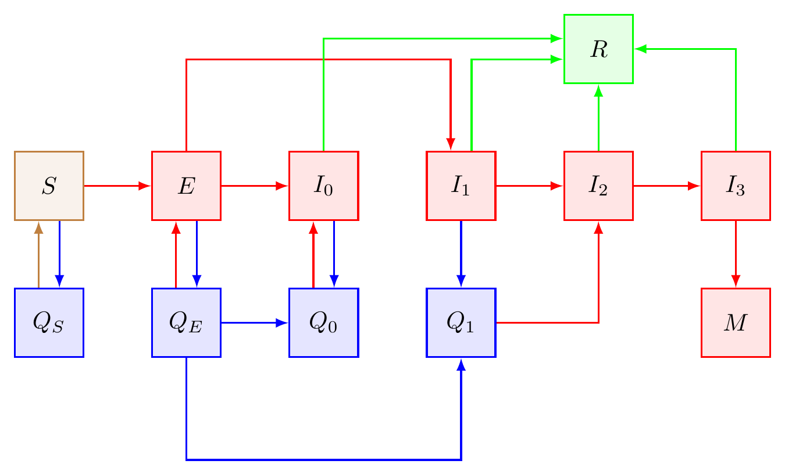

```{r setup, include=FALSE}
knitr::opts_chunk$set(echo = TRUE)

rm(list = ls())

#Required libraries to run the model
library(deSolve)
library(tidyverse)
library(sfsmisc)
library(kableExtra)

#Working directory
dir <- "~/Dropbox/Coronavirus/ModelbyCategoriesMarch30"
params.file   <- "parameters.csv"
resource.file <- "resources.csv"
setwd(dir)

source("modelo.edad.R")
source("read.parameters.R")
source("auxiliary.functions.R")
```

## Modelo

```{r, out.width='65%', fig.align='center', fig.cap='Figura 1', echo = FALSE}

```

Se desarrolló un modelo multigrupo SEIRS para describir la propagación del COVID-19 en México, asumiendo distintos escenarios de cuarentena . El modelo presentado toma en cuenta la heterogeneidad del estado de infección, es decir, los grupos de variantes clínicos que pueden ocurrir cuando se contrae la enfermedad. También se considera que la población se puede dividir en *m* clases, que pueden referirse tanto a grupos de edad, clases socioeconómicas o la mezcla de las anteriores. Cada grupo $k$, donde $1≤ k ≤m$, es a su vez particionado en compartimientos
donde $S_k$ representa a los individuos susceptibles, $E_k$ a los individuos en periodo latente, $A_k$ a los asintómaticos, $I_k$ a los individuos que han sido infectados, $I_{1, k}$ representa a los infectados con síntomas leves, $I_{2,k}$ a los infectados en estado grave, $I_{3,k}$ a infectados en estado crítico, $M_{k}$ representa el número de muertos de individuos en estado crítico y $R_k$ a los individuos recuperados. Las cuarentenas son divididas en dos tipos: la primera representa una cuarentena voluntaria, donde un porcentaje $Q_{S,k}$ de la población susceptible y de la población asintomática ($Q_{1,k}$) entra en aislamiento; la segunda cuarentena se compone de los pacientes infectados con síntomas leves $Q_{2,k}$ y se considera que sólo un porcentaje de la población entrará a este grupo. La Figura 1 describe el modelo de compartimientos utilizado. [-@arXiv_v2, -@arXiv_v1]

Las variables del modelo son:

### Variables
\begin{align}
 S & = \text{ Susceptibles (pueden enfermar)} \\
 E & =  \text{Expuestos (incubando)} \\
 I_0 & = \text{Infectados asintomáticos} \\
 I_1 & = \text{Infectados con síntomas leves} \\
 I_2 & = \text{Infectados graves que requieren cama de hospital} \\
 I_3 & = \text{Infectados críticos que requieren terapia intensiva} \\
 Q  & = \text{Susceptibles en cuarentena voluntaria} \\
 Q_1 & =\text{Asintomáticos en cuarentena voluntaria} \\
 Q_2 & = \text{Infectados con síntomas leves en cuarentena} \\
 R  &= \text{Recuperados} \\
 M  & = \text{Muertos} 
\end{align}


### Ecuaciones
Si consideramos que la población es dividida en *m* grupos (grupos de edad, nivel socioeconómico o cualquier otra variable de interés)

\begin{eqnarray}
    \dfrac{dS_k}{dt} & = & \Gamma_{S,k} - {\alpha_k(t)\,} \sum_{\ell = 1}^{m} \bigg( \sum_{j = 0}^{3} \gamma_{j,\ell} I_{j,\ell} \bigg) \cdot S_k  \\
    &&{- \sum_{i = 1}^\infty q_{i,k} \cdot S_k(\tau_{i,k}^\text{init})
    \Big(\delta(t - \tau_{i,k}^\text{init}) - \delta(t - \tau_{i,k}^\text{final}) \Big),
    } \label{eq:Sk} \\
    \dfrac{dE_k}{dt} & = & \Gamma_{E,k} + {\alpha_k(t)\,} \sum_{\ell = 1}^{m} \bigg( \sum_{j = 0}^{3} \gamma_{j,\ell} I_{j,\ell} \bigg) \cdot S_k - \gamma_{E,k} E_k, \label{eq:Ek} \\
    \dfrac{dI_{0,k}}{dt} & = & \Gamma_{A,k} +  p_{A,k} \cdot \gamma_{E,k} \cdot E_k - \beta_{A \to R, k} \cdot I_{0,k},  \\
    & & - {\sum_{i = 1}^\infty \Big( q_{i,k} \cdot I_{0,k} \cdot \delta(t - \tau_{i,k}^\text{init}) - Q_{1,k} \cdot \delta(t - \tau_{i,k}^\text{final}) \Big),} \\
    \dfrac{dI_{1,k}}{dt} & =& \Gamma_{1,k} +  (1 - p_{A,k}) \cdot \gamma_{E,k} \cdot  E_k  - \Big( p_{I_{2,k}} \cdot \beta_{1 \to 2, k} + (1 - p_{I_{2,k}}) \beta_{1 \to R, k} - q_{2,k} \Big) \cdot I_{1,k}, \\
    \dfrac{dI_{2,k}}{dt} & = &  p_{I_{2,k}} \cdot \beta_{1 \to 2, k}\cdot \big( Q_{2,k} + I_{1,k} \big)  \\
    && - \Big( p_{I_{3,k}} (I_2) \cdot  \beta_{2\to 3,k}(I_2) + \big( 1 - p_{I_{3,k}}(I_2) \big) \cdot \beta_{2 \to R,k} (I_2)\Big) \cdot I_{2,k}, \\
    \dfrac{dI_{3,k}}{dt} & = &  p_{I_{3,k}}(I_2) \cdot \beta_{2\to 3,k} (I_2) \cdot I_{2,k}  \\
    &&- \Big( \big(1 - p_{M,k}(I_3) \big) \cdot \beta_{3\to R, k} + p_{M,k}(I_3) \cdot \beta_{3 \to M, k} \Big) \cdot I_{3,k},  \\
    \dfrac{dM_{k}}{dt} & = & p_{M,k}(I_3) \cdot \beta_{3\to M,{k}} \cdot I_{3,k}, \\
    \dfrac{dQ_{S,k}}{dt} & = & {\sum_{i = 1}^\infty q_{i,k} \cdot S_k(\tau_{i,k}^\text{init})
    \Big(\delta(t - \tau_{i,k}^\text{init}) - \delta(t - \tau_{i,k}^\text{final}) \Big) } \label{eq:QSk}, \\
    \dfrac{dQ_{1,k}}{dt} & = & - \beta_{A \rightarrow R,k}\cdot Q_{1, k} + {\sum_{i = 1}^\infty \bigg( q_{i,k} \cdot I_{0,k} \cdot \delta(t - \tau_{i,k}^\text{init}) - Q_{1,k} \cdot \delta(t - \tau_{i,k}^\text{final}) \bigg),} \\
    \dfrac{dQ_{2,k}}{dt} & = & q_{2,k} \cdot I_{1,k} - \Big( p_{I_{2,k}}\cdot \beta_{1 \rightarrow 2, k} + (1 - p_{I_{2,k}}) \cdot  \beta_{1 \rightarrow R,k} \Big) \cdot Q_{2,k},
\end{eqnarray}
donde $j= 0, 1, 2, 3$ representa el estado de la infección y $k, l = 1, 2, ...., m$ el grupo de edad. El total de individuos infectados $I_j = \sum_{j=0}^{M} I_{j,k}$, donde $$ p_{I_{M,k}}(I_3) = \begin{cases}
    q_{M,k}^1, & \textrm{ if } I_3 < \hat{I}_3, \\
    q_{M,k}^2, & \textrm{ if } I_3 \geq \hat{I}_3, 
    \end{cases}$$
denota el porcentaje de personas que pueden ser tratadas si $\hat I_3$ representa el número de casos necesarios para saturar las unidades de cuidado intensivo del sistema de salud. Similarmente, se tiene que

$$ p_{I_{2,k}}(I_2) = \begin{cases}
    q_{3,k}^1, & \textrm{ if } I_2 < \hat{I}_2, \\
    q_{3,k}^2, & \textrm{ if } I_2 \geq \hat{I}_2, 
    \end{cases}$$
donde $\hat I_{2}$ representa el número de casos de infectados que saturan el sistema de salud pata camas con conexión de oxígeno

Los parámetros $\Gamma_{j,k}$ representan las tasas de recrutamiento o migración con:
$$
\gamma_{j, \ell} = \lambda_{j, \ell} \sum_{k = 1}^{m} c_{\ell}^{k} I_{j,k},
$$
donde $j =0, 1, 2, 3$, $k = 1, ...., m$, la tasa de contagio es representada para cada infección del tipo $j$ y para cada grupo $l$, entonces, con $\lambda_{j,k}$ y con la matriz $C= c_{l}^{k}$, donde cada entrada $c_{l}^{k}$ representa la tasa de contacto entre grupos $l$ y $k$, la tasa de contagio $\gamma_{k,l}$ puede ser definida.

En este modelo los parámetros representan:


 
|         Variable            |     Interpretación                                                                        |
|:---------------------------:|:------------------------------------------------------------------------------------------|
| $p_A$                    | Proporción de asintomáticos                                                              |            
| $p_{I_2}$                | Proporción de infecciosos tipo 1 que se vuelven tipo 2                                   |                            
| $p_{I_3}$                | Proporción de infecciosos tipo 2 que se vuelven tipo 3                                   |                         
| $p_{M}$                  | Proporción de infecciosos tipo 3 que se mueren                                           |            
| $\tau_1$                 | Día de implementación de la cuarentena $Q_1$                                           |            
| $\tau_2$                 | Día de implementación de la cuarentena $Q_2$                                           |            
| $\Delta \tau_1$          | Duración de la cuarentena $Q_1$                                                        |            
| $\Delta \tau_2$          | Duración de la cuarentena $Q_2$                                                        |            
| $\lambda_{I_1\to I_2}$   | Promedio de días en los que infecciosos tipo 1 se vuelven tipo 2                         |          
| $\lambda_{I_2\to I_3}$   | Promedio de días en los que infecciosos tipo 2 se vuelven tipo 3                         |         
| $\gamma_E$              | Tasa de incubación                                                                       |          
| $\lambda_{Q_2 \to I_2}$  | Tasa con la que infectados tipo 1 en cuarentena pueden volverse infectados tipo 2        |        
| $\lambda_{I_1\to R}, \lambda_{I_2\to R}, \lambda_{I_3\to R}$   | Promedio de días en los que infecciosos tipo 1 se vuelven tipo 2 | 
| $\lambda_{I_3\to M}$     | Promedio de días antes de morir para infectados tipo 3|
| $\lambda_{R \to S}$       |  Si hay remisión, número promedio de días en la que los recuperados se vuelven susceptibles de nuevo. |
| $\gamma_{1}, \gamma_{2}, \gamma_{3}$ |  Tasa de contagio para cada uno de los estadíos de infección sintomática $I_1, I_2, I_3$ |
| $\gamma_A$               | Tasa de contagio para los asintomáticos |
| $q_1$ | Proporción de individuos en cuarentena sin síntomas (susceptibles y     asintomáticos) |
| $q_2$ | Proporción de individuos en cuarentena con síntomas de infección tipo $1$ |
  

### Cuarentenas
Para mitigar el contagio se implementaron 3 tipos de cuarentena en el modelo:

* **Cuarentena tipo 1**. Son las cuarentenas del tipo voluntario, donde un porcentaje $q_{i,k}$ de la población adopta la cuarentena de un tiempo inicial $\tau_{i,k}^{inicial}$ a un tiempo $\tau_{i,k}^{final}$. Este tipo de cuarentenas pueden ser implementadas de distinta forma para cada grupo $k$, indicado por el índice $i$.  Por ejemplo, para la solución de la ecuación $\frac{d Q_{S,k}}{dt}$:

$$
Q_{S,k} = Q_{S,k}(0) +
    \sum_{i = 1}^\infty q_{i,k} \cdot S_k(\tau_{i,k}^\text{init})
    \Big(\mathcal{H}(t - \tau_{i,k}^\text{init}) - \mathcal{H}(t - \tau_{i,k}^\text{final}) \Big),
$$
donde $\mathcal{H}$ es una función Heaviside:


$$
      \mathcal{H}(t) = \begin{cases}
      0, & \text{if } t < 0 \\
      1, & \text{if } t > 0
      \end{cases}.
$$

* **Cuarentena tipo 2**. Representan la cuarentena voluntaria del porcentaje $q_{2,k}$ individuos que presentan síntomas de la enfermedad.
* **Cuarentena tipo 3**. También llamadas toque de queda. Son controladas para cada grupo de la siguiente manera:
  $$
      \alpha_k(t) \;=\; \begin{cases}
      1,   & t \in [0,\,6) \mod{7} \\
      q_{S,k}, & t \in [6,\,7) \mod{7}
      \end{cases}.
  $$
Cada $q_{S,k}$ puede variar en el tiempo al rotar la circulación de individuos. 

### Condiciones iniciales

Las condiciones iniciales para el modelo se definen como $M_k(0) = Q_{S,k}(0) = Q_{1,k}(0) =  Q_{2,k}(0) =0$ para $k=1, ..., m$ al inicio de la enfermedad. Las variables $I_{j,k}(0)$ también pueden considerarse nulas. La población total inicial se divide entre el total inicial de susceptibles $S_{k}(0)$, expuestos $E_{k}(0)$ e infectados asintomáticos $I_{0,k}(0)$ y debe satisfacer:

$$  
  \sum_{k = 1}^m \Big( S_{k}(0) + E_{k}(0) + I_{0,k}(0) \Big) \;=\; 1,
$$

### Programación

El modelo se encuentra programado en R y puede consultarse en (link). Actualmente el modelo considera 

## Datos

Los parámetros del modelo por edad:

```{r, warning = FALSE, echo = FALSE}
#Parameter list
param.table <- read.table(params.file, header = TRUE, sep = ",", 
                          row.names = 1, stringsAsFactors = F)
kable(param.table) %>% kable_styling()
```

Los recursos que consideramos son:
```{r, warning = FALSE, echo = FALSE}
#Parameter list
resource.table <- read.table(resource.file, header = F, sep = ",", 
                          row.names = 1, stringsAsFactors = F)
kable(resource.table) %>% kable_styling()
```

## Modelo

Lectura de parámetros: 

```{r, warning = FALSE}
#Parameter list
initial.list <- read.parameters(params.file, resource.file = resource.file)
params       <- initial.list$params
state        <- initial.list$state
```

### Ejecución simple

Para correr el modelo basta con ejecutar el siguiente código
```{r, warning = FALSE}
#You can run model with run model.instance
ode.model <- run.model.continuous(params, state,  init.time = 0, end.time = 100)
```

Y graficar los casos infectados
```{r, warning = FALSE}
ggplot.epidemiological.lines.infected(ode.model)
```

El modelo es un modelo por categorías por tanto también se puede generar una gráfica de los estados infectados por categoría:
```{r}
ggplot.epidemiological.lines.infected.cat(ode.model)
```

### Variaciones de política

El modelo permite implementar distintas opciones de política en distintos sectores. En el siguiente ejemplo evaluamos:

    1. La evolución usual de la enfermedad
    
    2. Una política de cuarentena poblacional
    
    3. Una política de cuarentena periódica "hoy no circula"
    
    4. Una política de crecimiento usual de la enfermedad bajo un cambio en el $R_0$
    
    5. Una política de cuarentena poblacional bajo un cambio en el $R_0$
    
    6. Una política de cuarentena a adultos mayores de 60 años


```{r, warning = FALSE}
#You can run model with run model.instance
model.1 <- run.model.continuous(params, state,  init.time = 0, end.time = 20)
```


```{r, warning = FALSE}
#And then add quarantine
state   <- quarantine_all(model.1$state)
model.2 <- run.model.continuous(params, state, init.time = 20, end.time = 30)
```

```{r, warning = FALSE}
#Then continue model wth periodic quarantine
state   <- unquarantine_all(model.2$state)
model.3 <- run.model.periodic(params, state, init.time = 30, end.time = 50,
                                  periodicity = 7, days = 2)
```

```{r, warning = FALSE}
#Change R0
params  <- rnought.change.gamma.1(1.2, params)
model.4 <- run.model.continuous(params, model.3$state, init.time = 50, end.time = 60)
```

```{r, warning = FALSE}
#And then add quarantine
state   <- quarantine_all(model.4$state)
params  <- rnought.change.gamma.1(2.1, params)
model.5 <- run.model.continuous(params, state, init.time = 60, end.time = 70)
```

```{r, warning = FALSE}
#And then add quarantine for specific subgroups
state   <- quarantine_k(model.5$state, k = c(3,4))
model.6 <- run.model.continuous(params, state, init.time = 70, end.time = 80)
```

```{r, warning = FALSE}
ggplot() +
  geom_line(aes(x = time, y = I1 + QI, 
                color = "Evolución usual"), data = model.1$dats) + 
  geom_line(aes(x = time, y = I1 + QI,
                color = "Cuarentena poblacional"), 
            data = model.2$dats) + 
  geom_line(aes(x = time, y = I1 + QI,
                color = "Cuarentena periódica"), data = model.3$dats) + 
  geom_line(aes(x = time, y = I1 + QI,
                color = "Evolución usual con R0 = 1.2"), data = model.4$dats) +
  geom_line(aes(x = time, y = I1 + QI,
                color = "Cuarentena poblacional  con R0 = 2.1"), 
            data = model.5$dats) +
  geom_line(aes(x = time, y = I1 + QI,
                color = "Cuarentena de mayores de 60 con R0 = 2.1"), 
            data = model.6$dats) +
  theme_classic() +
  ggtitle("Distintos esquemas de cuarentena del modelo") +
  ylab("Infectados (proporción)") +
  xlab("Tiempo")
```

### Desabasto hospitalario y efecto cascada

El modelo actual incluye un efecto de saturación del sistema "efecto cascada". En los parámetros se puede establecer los niveles de saturación del sistema a partir de la base de recursos:

```{r, warning = FALSE, eval = TRUE}
#Parameter list
initial.list <- read.parameters(params.file, estimate.saturation = TRUE, 
                                resource.file = resource.file)
params       <- initial.list$params
state        <- initial.list$state
```

También puede cambiarse de manera manual en los parámetros:


```{r}
params$saturationI2 <- 0.001
params$saturationI3 <- 0.0001
saturated.model <- run.model.continuous(params, state,  init.time = 0, end.time = 100)
```

Si se desea correr el modelo sin saturación basta poner los parámetros de saturación en infinito:

```{r}
params$saturationI2 <- Inf
params$saturationI3 <- Inf
unsaturated.model <- run.model.continuous(params, state,  init.time = 0, end.time = 100)
```

Y pueden compararse ambos escenarios:

```{r}
ggplot() +
  geom_line(aes(x = time, y = M, color = "Saturated"), data = saturated.model$dats) +
  geom_line(aes(x = time, y = M, color = "Unaturated"), data = unsaturated.model$dats) +
  theme_bw() +
  ggtitle("Mortalidad por COVID-19")
```

## TODO

+ Arreglar la cuarentena de E

+ Arreglar la cuarentena de I1 bajo el esquema voluntario

+ Crear gráficas de incidencias de casos

+ Crear gráficas de demanda hospitalaria

+ Agregar migración

## Colaboración
Para colaborar en el modelo requieres conocimiento de epidemiología matemática,
y/o epidemiología, sistemas dinámicos. Cualquier agregado está guiado por el comité científico.

Agregados de programación siempre y cuando se limiten a mejorar las gráficas, la evaluación del modelo *pero no el modelo*.

Traducciones bienvenidas.

## Código

Ver código en [Github](https://github.com/RodrigoZepeda/CoronavirusModel)

## Referencias